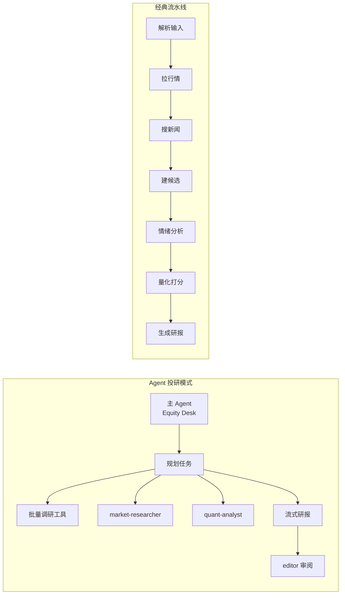
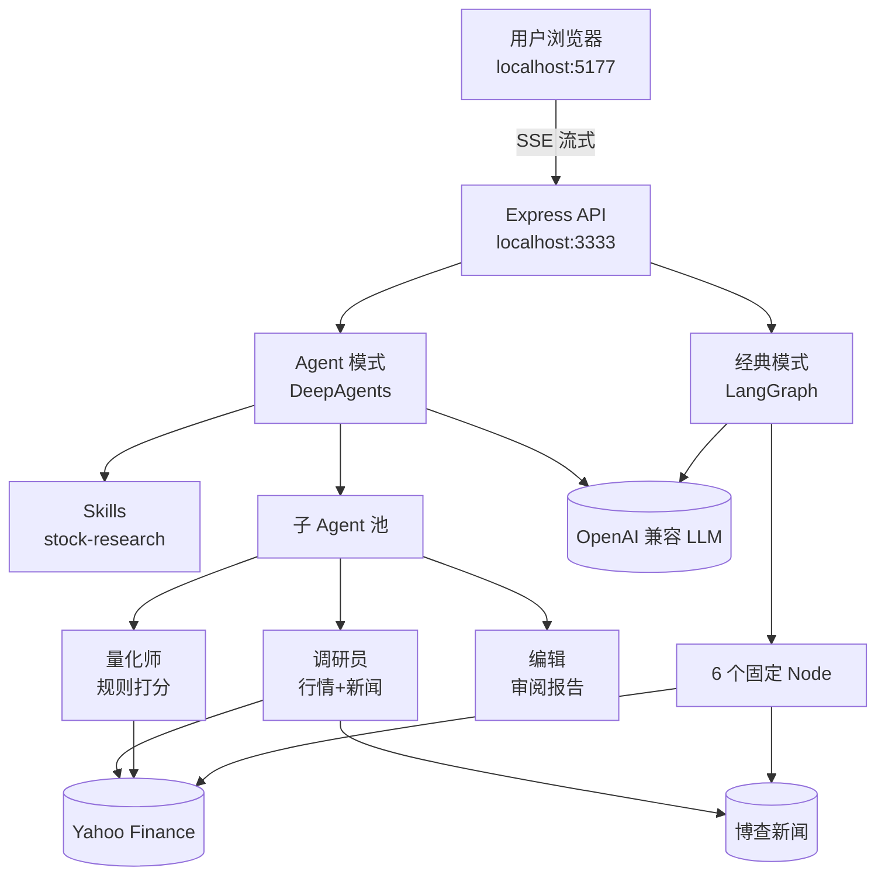
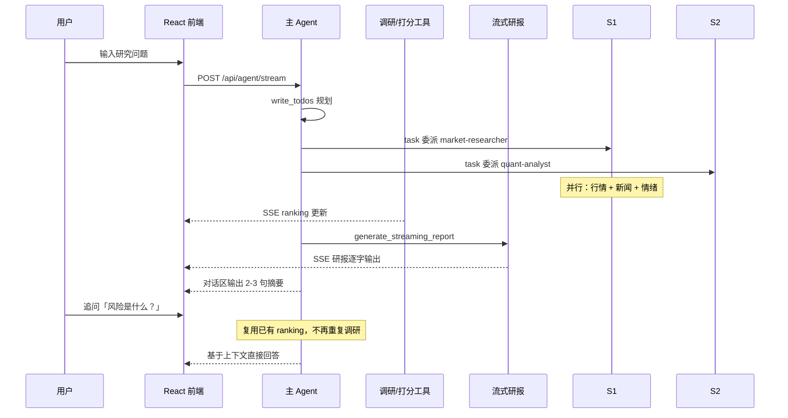

# AI 股票投研助手 — 演示指南

> 面向技术分享与产品演示，帮助观众快速理解「多 Agent 协作」与「固定流水线」的差异。  
> 正文约 600 字 · 仅供学习演示，**不构成投资建议**。

---

## 1. 项目是什么？

这是一个 **AI 股票投研助手 Demo**。用户用自然语言描述研究需求（如「对比 NVDA 与 AMD」），系统自动拉取行情与新闻、量化打分、生成中文研报，并在网页上**实时流式展示**全过程。

核心价值：**用同一业务场景，对照两种 AI 应用范式**——灵活的 Agent 协作 vs 可预测的 Workflow 流水线。

---

## 2. 两种模式一览


| 维度   | Agent 投研模式（默认）           | 经典流水线模式                      |
| ---- | ------------------------ | ---------------------------- |
| 执行方式 | 主 Agent 自主规划、委派子 Agent   | LangGraph 固定 6 步顺序执行         |
| 灵活性  | 可追问、可调整策略                | 路径固定，行为可复现                   |
| 可视化  | 任务规划、子 Agent、工具调用        | 步骤进度条                        |
| API  | `POST /api/agent/stream` | `POST /api/recommend/stream` |





---

## 3. 系统架构




**数据流要点**：前端通过 SSE 接收进度、排序榜单、研报片段；会话中间结果保存在服务端内存（按 `sessionId` 隔离），刷新页面会清空对话历史。

---

## 4. Agent 模式执行流程




---

## 5. 页面布局（演示时指给观众看）

```
┌─────────────────────────────────────────────────────────────┐
│  [Agent 投研]  [经典流水线]                    [新研究]      │
├──────────────────────┬──────────────────────────────────────┤
│  对话区               │  推荐排序（可解释打分）               │
│  · 用户问题           │  #1 NVDA  82分  bullish              │
│  · Agent 摘要回复     │  #2 AMD   76分  neutral             │
│                      ├──────────────────────────────────────┤
│  活动面板             │  研报区（Markdown 流式渲染）          │
│  · 任务 Todo          │  ## 投资摘要 …                       │
│  · 子 Agent 状态      │  ## 个股分析 …                       │
│  · 工具调用计数       │                                      │
└──────────────────────┴──────────────────────────────────────┘
```

---

## 6. 现场演示步骤

**准备**（约 1 分钟）

```bash
npm install
cp .env.example .env   # 填入 OPENAI_API_KEY，可选 BOCHA_API_KEY
npm run dev
```

**演示脚本**（约 5 分钟）

1. **开场**：打开 [http://localhost:5177，说明默认是](http://localhost:5177，说明默认是) Agent 模式，强调「看得见 Agent 在做什么」。
2. **发起研究**：使用内置示例，如「研究 AI 芯片股：NVDA, AMD, TSM…」。
3. **指进度**：左侧出现 Todo 与子 Agent 活动；右侧陆续出现推荐排序。
4. **指研报**：下方研报区流式输出 Markdown，对话区只保留简短摘要。
5. **追问**：输入「前三名各自最大风险？」，展示 Agent 复用上下文、不重复调研。
6. **对比**：切换到「经典流水线」，同样输入，指出步骤固定、无子 Agent 委派。
7. **收尾**：强调技术栈与免责声明。

---

## 7. 技术栈速览

- **Agent 框架**：DeepAgents + LangChain Skills
- **流水线**：LangGraph StateGraph
- **前端**：React 19 + Vite 7
- **后端**：Express 5 + SSE
- **数据源**：Yahoo Finance（行情）、博查 AI（新闻）

---

## 8. 常见问题（Q&A）

**Q：刷新页面后对话没了？**  
A：对话历史存在浏览器内存；中间 ranking 在服务端 session 内存，新研究会生成新 session。

**Q：为什么 Agent 模式有时比较慢？**  
A：默认优先委派 market-researcher 与 quant-analyst 子 Agent，过程更可见；若委派失败会回退到 `run_batch_stock_research` 批量路径。

**Q：和真实投研系统差在哪？**  
A：本 Demo 侧重架构演示，打分规则简化，无实盘交易与合规审查，请勿用于真实投资决策。

---

*相关文档：[DEMO-ORAL.md](./DEMO-ORAL.md)（口头讲解稿）· [AGENT-ARCHITECTURE.md](./AGENT-ARCHITECTURE.md) · [FLOW.md](./FLOW.md)*