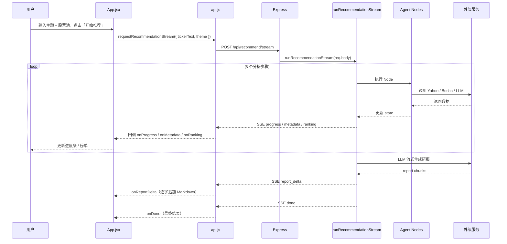

# 项目业务流程

本文档描述 `stock-recommend-agent-demo` 从用户输入到推荐结果展示的完整业务流程。

## 1. 整体架构

```
┌─────────────────────────────────────────────────────────────┐
│  前端 (React + Vite, port 5177)                              │
│  web/src/App.jsx  →  api.js (SSE 流式)                       │
└──────────────────────────┬──────────────────────────────────┘
                           │ POST /api/recommend/stream
                           │ (dev 时 Vite proxy → 3333)
┌──────────────────────────▼──────────────────────────────────┐
│  后端 (Express, port 3333)                                   │
│  server/index.mjs                                            │
│    ├─ /api/recommend        同步（LangGraph 一次性 invoke）   │
│    └─ /api/recommend/stream 流式（逐步执行 + SSE）            │
└──────────────────────────┬──────────────────────────────────┘
                           │
┌──────────────────────────▼──────────────────────────────────┐
│  Agent 流水线（6 个 Node）                                    │
│  LangGraph StateGraph 或 recommendation-stream.mjs          │
└──────────────────────────┬──────────────────────────────────┘
                           │
        ┌──────────────────┼──────────────────┐
        ▼                  ▼                  ▼
  Yahoo Finance      Bocha 新闻搜索      OpenAI 兼容 LLM
  (行情数据)         (BOCHA_API_KEY)    (情绪 + 研报)
```

**启动方式：**

- `npm run dev`：同时启动后端（`node --watch server/index.mjs`）和前端（`vite`）
- `npm run build` + `npm start`：前端打包到 `dist/`，Express 同时提供静态资源和 API

## 2. 用户请求完整流程



## 3. Agent 流水线（核心 6 步）

LangGraph 定义在 `server/graph.mjs`，是一条**线性流水线**：

```
START → normalize_input → fetch_stock_data → search_recent_news
      → build_candidates → analyze_sentiment → score_stocks
      → generate_report → END
```

前端实际走的是 `server/recommendation-stream.mjs`，步骤相同，但**研报生成单独流式输出**。

### Step 1：解析股票池 `normalize_input`

| 项目 | 说明 |
|------|------|
| 文件 | `server/nodes/normalize-input.mjs` |
| 输入 | `tickerText` 或 `tickers` + `theme` |
| 处理 | 去重、转大写、正则校验、最多 5 只 |
| 输出 | `{ tickers: ["NVDA","AMD",...], theme: "AI 芯片股" }` |

### Step 2：获取行情 `fetch_stock_data`

| 项目 | 说明 |
|------|------|
| 文件 | `server/nodes/fetch-stock-data.mjs` |
| 工具 | `server/tools/yahoo-finance.mjs` |
| 策略 | 先调 Yahoo Chart API，失败再 fallback 到 `yahoo-finance2` quote |
| 数据 | 价格、涨跌幅、52 周高低、PE、市值等 |
| 限速 | 每只股票间隔 300ms |

### Step 3：搜索新闻 `search_recent_news`

| 项目 | 说明 |
|------|------|
| 文件 | `server/nodes/search-news.mjs` |
| 工具 | `server/tools/bocha-search.mjs`（博查 AI 搜索 API） |
| 前置 | 依赖 Step 2 返回的 `state.stocks`，串行执行 |
| 查询 | `{ticker} {shortName} stock latest news {theme}`，公司名与 ticker 相同时省略 |
| 输出 | `newsResults`，供 Step 4 `build_candidates` 合并 |
| 降级 | 无 `BOCHA_API_KEY` 时跳过，记 warning |

### Step 4：分析情绪 `analyze_sentiment`

| 项目 | 说明 |
|------|------|
| 文件 | `server/nodes/analyze-sentiment.mjs` |
| 首选 | LLM 分析新闻，返回 JSON（`bullish` / `neutral` / `bearish`） |
| 降级 | 本地关键词启发式 |
| 输出 | 每只 candidate 增加 `sentiment: { label, confidence, reason }` |

### Step 5：计算推荐分 `score_stocks`

| 项目 | 说明 |
|------|------|
| 文件 | `server/nodes/score-stocks.mjs` |
| 逻辑 | `server/utils/scoring.mjs` |

四维加权评分：

| 维度 | 权重 | 依据 |
|------|------|------|
| momentum 动量 | 30% | 日内涨跌幅 + 52 周价格位置 |
| fundamentals 基本面 | 20% | PE 估值区间 |
| sentiment 情绪 | 30% | LLM/启发式情绪标签 + 置信度 |
| riskControl 风控 | 20% | 数据完整性、高 PE、大波动、riskFlags |

综合分映射评级：强烈关注 / 关注 / 谨慎关注 / 暂不推荐，按分数降序排列。

#### 候选合并、情绪分析与推荐分细节

`build_candidates`、`analyze_sentiment`、`score_stocks` 是从原始数据进入推荐排序的核心三步：

1. **合并候选数据**

   `buildCandidatesNode()` 定义在 `server/nodes/search-news.mjs`。它先把 `state.newsResults` 按 `ticker` 建成 Map，再遍历 `state.stocks`，为每只股票组装统一的候选对象：

   ```javascript
   {
     ticker: stock.ticker,
     name: stock.shortName,
     stockData: stock,
     news,
     riskFlags,
   }
   ```

   `riskFlags` 在这里做第一轮风险标记：行情获取失败、新闻搜索 warning、近期新闻不足都会被写入候选对象。合并后的 `candidates` 后续会继续携带行情、新闻、风险提示和情绪分析结果。

2. **分析新闻情绪**

   `analyzeSentimentNode()` 定义在 `server/nodes/analyze-sentiment.mjs`。优先创建 LLM 模型，对每只股票最近最多 5 条新闻进行分析，要求模型只返回 JSON：

   ```json
   {
     "label": "bullish | neutral | bearish",
     "confidence": 0.0,
     "reason": "一句中文解释"
   }
   ```

   分析结果会写入 `candidate.sentiment`。如果 LLM 不可用、返回格式异常或调用失败，则降级到本地关键词启发式：正面词更多时标记 `bullish`，负面词更多时标记 `bearish`，否则标记 `neutral`。降级失败原因会追加到 `errors`，但不会中断整条推荐链路。

3. **计算推荐分**

   `scoreStocksNode()` 调用 `server/utils/scoring.mjs` 中的 `scoreCandidates()`。每只股票先计算四个 0-100 的因子分，再做加权求和：

   ```text
   推荐分 = momentum * 30%
          + fundamentals * 20%
          + sentiment * 30%
          + riskControl * 20%
   ```

   四个因子的来源如下：

   | 因子 | 计算方式 |
   |------|----------|
   | `momentum` | 日内涨跌幅转换分 + 当前价格在 52 周高低区间的位置 |
   | `fundamentals` | 主要根据 `trailingPE` / `forwardPE` 所在区间打分 |
   | `sentiment` | 将 `bullish` / `neutral` / `bearish` 映射为基础分，再按置信度向 50 分回归 |
   | `riskControl` | 从 90 分开始，按行情缺失、高 PE、大波动、`riskFlags` 数量扣分 |

   最后每只股票会得到 `score`、`rating`、`factors` 和更新后的 `riskFlags`，并按 `score` 从高到低排序形成 `ranking`。

### Step 6：生成研报 `generate_report`

| 项目 | 说明 |
|------|------|
| 文件 | `server/nodes/generate-report.mjs`（同步）<br>`server/utils/report-generation.mjs`（流式） |
| 首选 | LLM 流式生成中文 Markdown 研报 |
| 降级 | `fallbackReport()` 本地模板 |
| 流式 | 通过 SSE `report_delta` 事件逐块推送到前端 |

## 4. 共享状态 GraphState

定义在 `server/state.mjs`：

```javascript
{
  tickers,        // 标准化后的股票代码数组
  tickerText,     // 原始输入文本
  theme,          // 研究主题
  stocks,         // Yahoo 行情数据
  candidates,     // 行情 + 新闻 + 情绪
  ranking,        // 打分排序后的结果
  reportMarkdown, // 最终研报
  errors,         // 各环节累积的警告/错误
}
```

## 5. 两种 API 模式对比

| | `/api/recommend` | `/api/recommend/stream` |
|---|---|---|
| 执行方式 | `recommendationGraph.invoke()` 一次性跑完 | `runRecommendationStream()` 逐步执行 |
| 响应 | 一次性 JSON | SSE 事件流 |
| 前端使用 | `requestRecommendation()`（已实现但未用） | `requestRecommendationStream()`（**当前 UI 使用**） |
| 研报 | 同步生成完毕 | 流式 `report_delta` 逐字显示 |

### SSE 事件类型

| 事件 | 时机 | 内容 |
|------|------|------|
| `progress` | 每步开始/完成 | `{ step, status: "running" \| "completed" }` |
| `metadata` | 解析完成后 | `{ tickers, theme }` |
| `ranking` | 打分完成后 | `{ ranking, errors }` |
| `report_delta` | 研报流式输出 | Markdown 文本块 |
| `done` | 全部完成 | 最终结果 |
| `error` | 异常 | `{ error }` |

## 6. 前端渲染逻辑

`web/src/App.jsx` 分三块展示：

1. **进度条** — 6 步实时高亮（解析 → 行情 → 新闻 → 情绪 → 打分 → 研报）
2. **推荐榜单** — `RankingCard` 展示 Top N：分数、评级、价格、涨跌幅、四维因子 meter、风险标签
3. **研报区** — `marked` 把流式 Markdown 渲染成 HTML

## 7. 外部依赖与降级策略

| 变量 | 作用 | 缺失时行为 |
|------|------|-----------|
| `OPENAI_API_KEY` | LLM 情绪分析 + 研报生成 | 情绪用启发式，研报用本地模板 |
| `BOCHA_API_KEY` | 新闻搜索 | 跳过新闻，记 warning |
| `YAHOO_FINANCE_PROXY` | Yahoo API 代理 | 直连（国内可能失败） |
| `OPENAI_BASE_URL` / `OPENAI_MODEL` | 兼容通义等 OpenAI 格式 API | 默认 `gpt-4o-mini` |

## 8. 一句话总结

> 用户输入股票池 → Agent 按固定 6 步流水线依次「解析 → 拉行情 → 搜新闻 → LLM 判情绪 → 规则打分 → LLM 写研报」，全程通过 SSE 流式推送到前端，每一步都有可解释的分数依据和降级方案。
